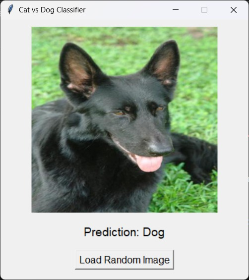
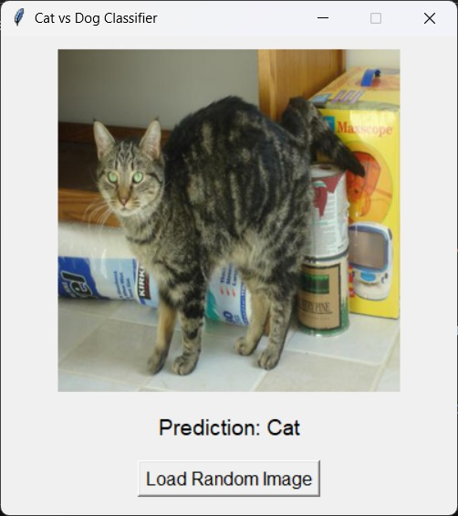

# Cat vs Dog Image Classifier 🐱🐶

This project is a Convolutional Neural Network (CNN) built with TensorFlow and Keras to classify images of cats and dogs. It includes data preprocessing, model training with augmentation and callbacks, single prediction, and model saving/loading.

---

## 📁 Dataset Structure

The dataset is split into **training** and **testing** sets.

```
cd_dataset/
├── training_set/
│   ├── cats/
│   └── dogs/
└── testing_set/
    ├── cats/
    └── dogs/
```

Each subfolder contains images of the respective class.

---

## 📦 Libraries Used

- TensorFlow / Keras
- Pillow (PIL)
- NumPy
- Matplotlib
- OS
- Warnings

---

## 🧹 Preprocessing Steps

1. **Corrupted Image Removal:**  
   Scans the dataset and removes unreadable images using PIL's `verify()`.

2. **Data Augmentation for Training:**
   - Rescale (1./255)
   - Random Shear
   - Random Zoom
   - Horizontal Flip

3. **Testing Set:**
   - Only rescaling applied.

---

## 🧠 Model Architecture

A sequential CNN with the following layers:

- Conv2D (32 filters) + MaxPooling
- Conv2D (64 filters) + MaxPooling
- Conv2D (128 filters) + MaxPooling
- Flatten
- Dense (128 units, ReLU) + Dropout (0.5)
- Output Layer (1 unit, Sigmoid)

**Loss Function:** Binary Crossentropy  
**Optimizer:** Adam  
**Metrics:** Accuracy  

---

## 🛑 Callbacks Used

- **EarlyStopping**: Stops training when validation loss stops improving.
- **ReduceLROnPlateau**: Reduces learning rate on a plateau in validation loss.

---

## 🚀 Training

Model is trained for up to **50 epochs** with early stopping and learning rate reduction applied.

```python
cnn.fit(
    x=training_set,
    validation_data=test_set,
    epochs=50,
    callbacks=[early_stop, reduce_lr]
)
```
## 📈 Training Results

| Metric           | Value (approx.)  |
|------------------|------------------|
| Training Accuracy| 90–95%           |
| Test Accuracy    | 85–90%           |
| Loss             | Stable around 0.2 after training |

Example Output:
```
Epoch 25/25
loss: 0.2143 - accuracy: 0.9120
Test Loss: 0.2321
Test Accuracy: 0.8875
---

## 🧪 Evaluation

Model is evaluated on the testing set to report accuracy and loss:

```python
loss, accuracy = cnn.evaluate(test_set)
```

---

## 🔍 Single Image Prediction

The model can predict a random image from the testing set and visualize it with the predicted label (`Cat` or `Dog`).

---

## 💾 Model Saving & Loading

Model is saved and reloaded using:

```python
cnn.save('CNN_model.keras')
cnn = load_model('CNN_model.keras')
```

---

## 📝 Requirements

Install required packages via pip:

```bash
pip install tensorflow pillow matplotlib numpy
```

---

## 📌 Notes

- All images are resized to **64x64** before input.
- Make sure your dataset path and structure match the script.
- Trained model (`CNN_model.keras`) will be saved in the working directory.

---

## 📷 Sample Prediction

Once prediction is made, the image is shown with the predicted label.




---
## 👥 Team Members

| ID         | Name                        | 
|------------|-----------------------------|
| 202203549  | Mohamed Adel Alksas         | 
| 202203193  | Mohamed Said Shalaby        |  
| 202203778  | Mohamed Magdy Ali           |  
| 202202378  | Mohamed Abd-Elaal Elsayes   |    
| 202203766  | Mohamed Tarek Hashad        | 
---

## 🔗 References

- [TensorFlow Documentation](https://www.tensorflow.org/api_docs)
- [Keras API Reference](https://keras.io/api/)
- [Pillow (PIL) Documentation](https://pillow.readthedocs.io/en/stable/)
- [NumPy Documentation](https://numpy.org/doc/)
- [Matplotlib Documentation](https://matplotlib.org/stable/contents.html)
- [ImageDataGenerator Guide - Keras](https://keras.io/api/preprocessing/image/)
- [EarlyStopping & ReduceLROnPlateau Callbacks - Keras](https://keras.io/api/callbacks/)
- [Kaggle Cats and Dogs Dataset](https://www.microsoft.com/en-us/download/details.aspx?id=54765)

---
